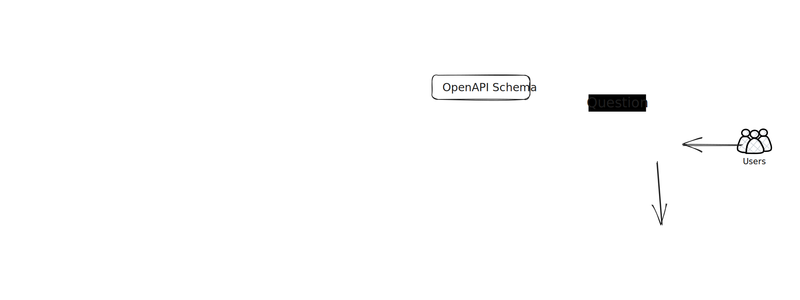

# MLOps Best Practices: Building Bedrock Agent to query Athena Database

This project is a part of the MLOps Best Practices series. In this project, we will build a Bedrock Agent to query Athena Database. The project is built using AWS CDK and Python.

## The Problem

Every organization has a data lake where they store their data. The data is stored in different formats and is queried using different tools. One of the most popular tools to query data in the data lake is Athena. Athena is an interactive query service that makes it easy to analyze data in Amazon S3 using standard SQL. With Athena, there is no need for complex ETL jobs to prepare the data for analysis. This makes it easy for anyone with SQL knowledge to query the data in the data lake.

However, not many people in the organization have SQL knowledge. This makes it difficult for them to benefit from the plethora of data stored in the data lake. To solve this problem, we can build a Bedrock Agent that understand natural language queries and can query the data and reply back with the results.

## Not only a demo

This project is designed not just as a demo. It is a real-world project that can be used in production. The project is built using best practices:

* **IaC**: The project is built using AWS CDK which is an Infrastructure as Code tool. This makes it easy to deploy the project in multiple environments.
* **Security**: Using IAM fine-grained permission can pass security review of CISO teams.
* **Modularity**: Using multiple managed services of AWS that can scale up and be configured to different enterprise environment.
* **Cost-effective**: Using serverless services that are cost-effective and can scale up and down based on the usage. In less than 10$ per month, you can have a Bedrock Agent that can query Athena Database.

## The Solution



The solution is built using the following services:

* **S3**: The data is stored in S3.
* **Glue**: The data in S3 is crawled and cataloged using Glue.
* **Athena**: The data in S3 is queried using Athena.
* **Lambda**: The Bedrock Agent is built using Lambda function as Action Group.
* **Bedrock**: The Bedrock Agent is built using Bedrock.
* **App Runner**: The UI for the Bedrock Agent is deployed using App Runner.

## Quick Start

1. Clone the repository

        git clone https://github.com/guyernest/bedrock-agent.git

1. Install the dependencies

        cd bedrock-agent
        python3 -m venv .venv
        source .venv/bin/activate
        pip install -r requirements.txt

1. Deploy the stack (wait for the deployment to finish, about 5 minutes, and note the output values for the next steps)

        cdk deploy

1. Upload the data to S3

        aws s3 cp sample-data/ s3://<bucket-name>/data --recursive

1. Trigger Glue Crawler (wait for the crawler to finish, about 2 minutes)

        aws glue start-crawler --name <crawler-name>

1. Open the App Runner URL in the browser (appears in the output of the CDK deployment)

## CDK Python Instructions

This project is set up like a standard Python project.  The initialization
process also creates a virtualenv within this project, stored under the `.venv`
directory.  To create the virtualenv it assumes that there is a `python3`
(or `python` for Windows) executable in your path with access to the `venv`
package. If for any reason the automatic creation of the virtualenv fails,
you can create the virtualenv manually.

To manually create a virtualenv on MacOS and Linux:

```shell
python3 -m venv .venv
```

After the init process completes and the virtualenv is created, you can use the following
step to activate your virtualenv.

```shell
source .venv/bin/activate
```

If you are a Windows platform, you would activate the virtualenv like this:

```shell
.venv\Scripts\activate.bat
```

Once the virtualenv is activated, you can install the required dependencies.

```shell
pip install -r requirements.txt
```

At this point you can now synthesize the CloudFormation template for this code.

```shell
cdk synth
```

To add additional dependencies, for example other CDK libraries, just add
them to your `setup.py` file and rerun the `pip install -r requirements.txt`
command.

## Useful commands

* `cdk ls`          list all stacks in the app
* `cdk synth`       emits the synthesized CloudFormation template
* `cdk deploy`      deploy this stack to your default AWS account/region
* `cdk diff`        compare deployed stack with current state
* `cdk docs`        open CDK documentation

Enjoy!
